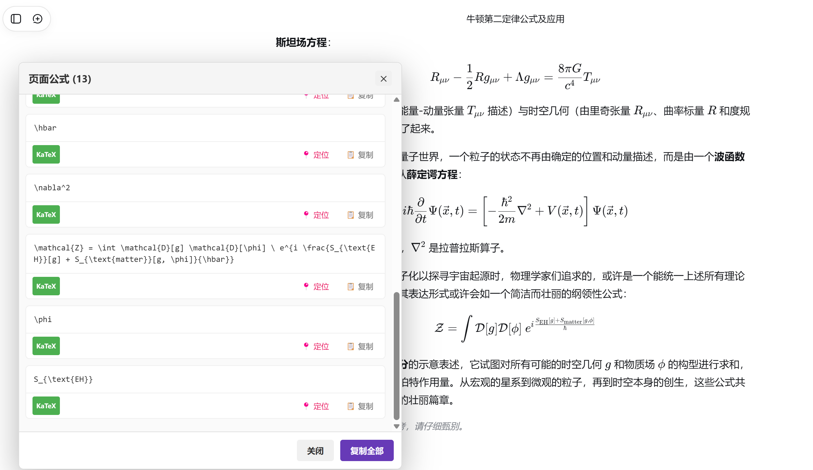

# Universal LaTeX Finder (Jump to Source)

## 简介

这是一个具有 Apple UI 风格的通用 Tampermonkey 脚本，可在任何网页上探测数学公式（LaTeX），支持一键复制、快速跳转定位以及图片公式识别功能。适用于包含数学公式的网站，如学术论文、教程、维基百科等。

## 功能特性

- 🔍 **智能探测**：自动识别网页中的多种数学公式格式
- 📋 **一键复制**：点击即可复制 LaTeX 公式代码
- 📍 **快速定位**：可直接跳转到网页中对应的公式位置
- 🎯 **多格式支持**：支持 KaTeX、MathJax 等多种数学公式
- 🖼️ **图片识别**：支持识别图片中的 LaTeX 公式（基于 AI OCR 技术）
- 💡 **Apple UI 设计**：采用 macOS 风格毛玻璃界面和丝滑动画效果
- 📱 **响应式布局**：适配不同屏幕尺寸，支持拖拽和缩放

## 支持的公式类型

| 类型 | 描述 |
|------|------|
| KaTeX | 使用 KaTeX 渲染的数学公式 |
| MathJax 2 | 使用 MathJax 2 渲染的数学公式 |
| MathJax 3 | 使用 MathJax 3 渲染的数学公式 |
| 图片公式 | 以图片形式展示的 LaTeX 公式 |

## 安装方法

1. 安装 [Tampermonkey](https://www.tampermonkey.net/) 浏览器扩展
2. 点击 [脚本安装链接] 或者手动创建新脚本
3. 将脚本代码粘贴到编辑器中
4. 保存脚本并确保启用

## 使用说明

1. 访问包含数学公式的网页（如维基百科数学条目）
2. 页面右下角会出现蓝色的 ∑ 悬浮按钮
3. 点击悬浮按钮，会弹出公式探测面板
4. 在面板中可以：
   - 查看页面上所有检测到的数学公式
   - 点击公式内容复制 LaTeX 代码
   - 点击「📍 定位」按钮跳转到网页中对应公式的位置
   - 点击「📋 复制」按钮单独复制某个公式
   - 点击「复制全部」按钮复制所有检测到的公式
   - 点击「🖼️ 识别图片」按钮识别剪贴板中的图片公式

## 效果图

## 用户界面

### 悬浮按钮
页面右下角的蓝色圆形按钮，鼠标悬停时会展开显示「探测公式」文字。支持拖拽移动位置。

### 公式面板
点击悬浮按钮后弹出的毛玻璃效果窗口，包含以下部分：

- **标题栏**：显示检测到的公式数量，支持拖拽移动面板
- **公式列表**：列出所有检测到的公式及其类型标签
- **底部操作栏**：
  - 关闭按钮：关闭面板
  - 识别图片：识别剪贴板中的图片公式
  - 复制全部：将所有公式复制到剪贴板
- **缩放手柄**：右下角的缩放手柄，支持调整面板大小

### 公式项
每个公式项由以下部分组成：

- 公式内容：显示公式的 LaTeX 代码，点击可复制
- 类型标签：标识公式来源（KaTeX、MathJax 等）
- 操作按钮：
  - 📍 定位：跳转到网页中的公式位置
  - 📋 复制：复制单个公式

## AI 图片识别功能

该脚本集成了基于 SiliconFlow 平台的 AI OCR 功能，可识别图片中的 LaTeX 公式：

1. 点击面板底部的「🖼️ 识别图片」按钮
2. 脚本会自动识别剪贴板中的图片，或提示选择本地图片文件
3. 通过 AI 模型识别图片中的公式并转换为 LaTeX 代码
4. 识别结果将自动添加到公式列表顶部

### 配置 AI 识别功能

要使用图片识别功能，需要配置 SiliconFlow API：

1. 注册 [SiliconFlow](https://siliconflow.cn/) 账号并获取 API Key
2. 在脚本面板中点击齿轮图标进入设置
3. 填写以下信息：
   - API Key：您的 SiliconFlow API 密钥
   - 模型名称：推荐使用 Qwen/Qwen3-VL-8B-Instruct
   - 接口地址：默认为 https://api.siliconflow.cn/v1
4. 点击保存完成配置

## 技术实现

脚本通过查询 DOM 中特定的元素和属性来识别数学公式：

1. **KaTeX 公式**：查找带有 `.katex` 类的元素，并从中提取 `annotation[encoding="application/x-tex"]` 的内容
2. **MathJax 2 公式**：查找 `script[type^="math/tex"]` 元素的内容
3. **MathJax 3 公式**：查找 `mjx-container` 和 `[role="math"]` 元素的 `aria-label` 或 `data-latex` 属性
4. **图片公式**：检查 `img` 元素的 `class`、`src` 或 `alt` 属性是否包含数学公式相关标识

AI 图片识别功能通过 SiliconFlow API 实现：
- 支持专用 OCR 模型和通用视觉大模型
- 自动处理图片编码和 API 请求
- 智能解析返回结果并提取 LaTeX 代码

## 权限说明

脚本需要以下权限：

- `GM_setClipboard`：用于将公式复制到剪贴板
- `GM_addStyle`：用于注入自定义样式
- `GM_xmlhttpRequest`：用于向 SiliconFlow API 发送请求
- `GM_getValue`/`GM_setValue`：用于保存和读取配置信息

## 兼容性

- 浏览器：支持所有安装 Tampermonkey 扩展的浏览器（Chrome、Firefox、Edge 等）
- Tampermonkey 版本：4.0 及以上版本
- 网站：适用于大多数使用常见数学公式渲染方式的网站

## 更新日志

### v4.0
- 全新 Apple UI 设计，采用毛玻璃效果和流畅动画
- 新增 AI 图片公式识别功能
- 支持面板拖拽和缩放
- 优化用户体验和界面交互

### v3.2
- 初始版本发布
- 支持多种数学公式格式的探测
- 实现复制和定位功能
- 设计友好的用户界面

## 许可证

本项目采用 MIT 许可证，详情请参见 [LICENSE](LICENSE) 文件。

## 贡献

欢迎提交 Issue 和 Pull Request 来改进此脚本。